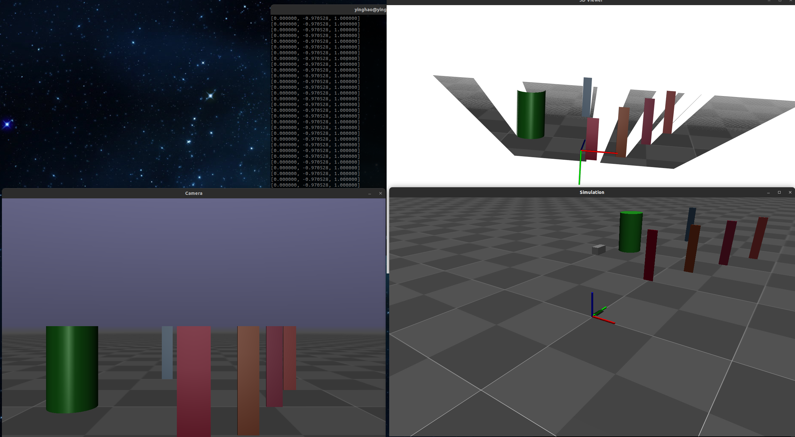

I implemented a RGBD camera and synthesised color point cloud in MuJoCo, since there is no native RGBD sensor support in MuJoCo so far (Version 2.3.3) (I am using 2.1.0).

I abstracted a class of a simple RGBD camera in MuJoCo, which can get color image and depth image from OpenGL color buffer and depth buffer and can also generate monochrome/colorful point cloud. 

In addition, I provided [demo codes](src/two_window.cpp) that can view the camera's sight and the color point cloud, as shown in the picture below.

The lower left image is the view of the camera, which is fixed. The bottom right image is the MuJoCo simulation world, where you can freely move your viewpoint. The top right image is the color point cloud rendered in PCL visualizer.

To run the code you need OpenCV and PCL. And modify some path in CMakeLists.txt and the model path in source code.
